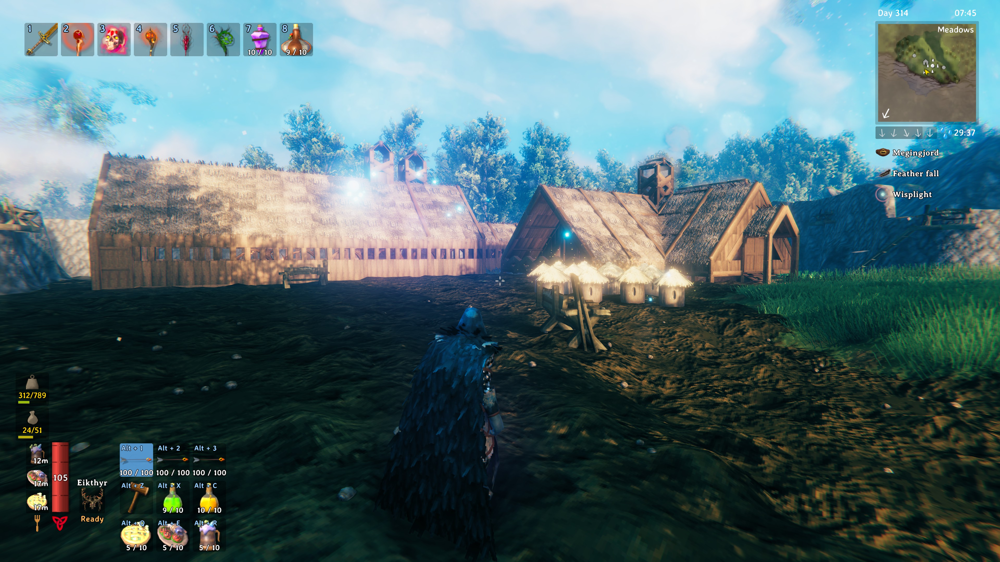
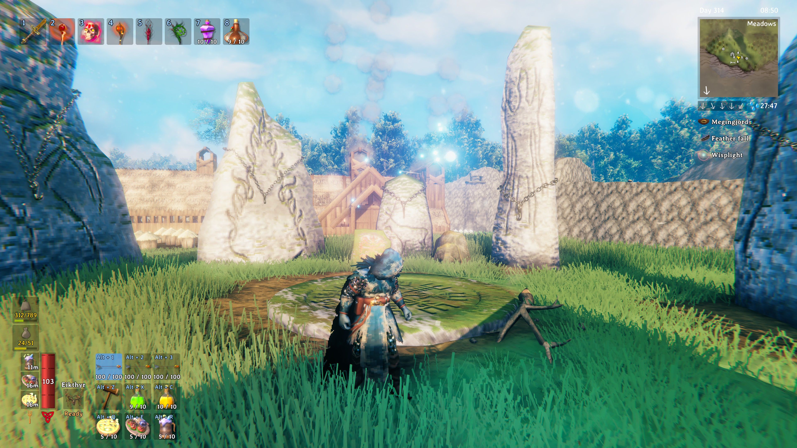
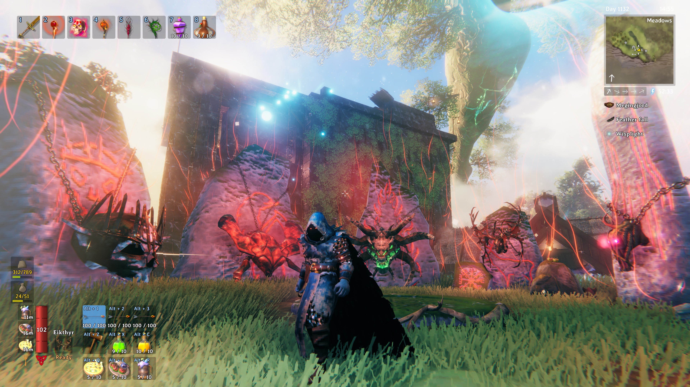
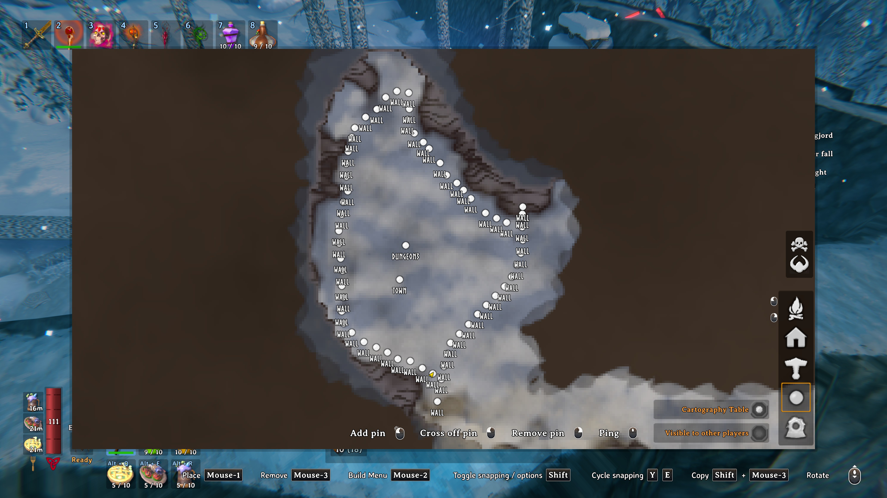
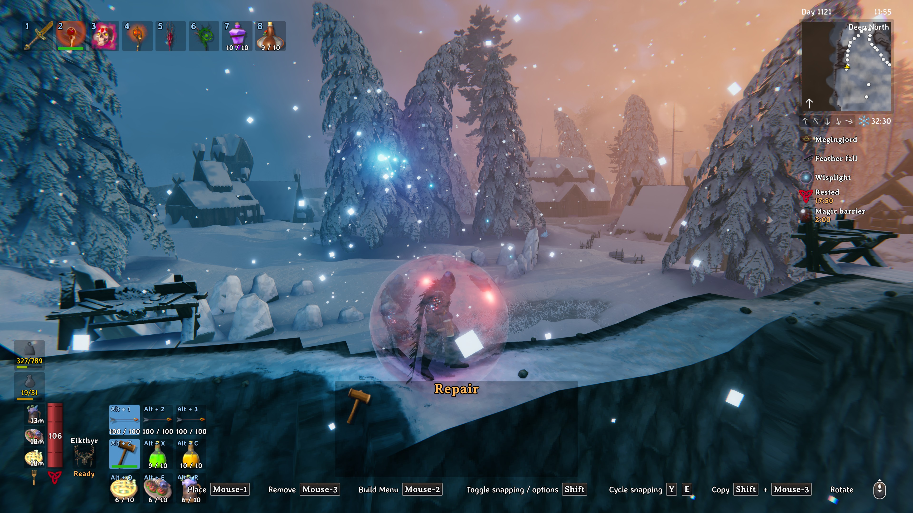

# Valheim
Valheim is a game developed by https://irongate.se/ 
 
# Valheim Description
Valheim is a survival type of game, food plays an important role in the player's survivability. 
 
# Disclaimer

Download the Valheim worlds that are shared here and feel free to make them your own. I don't want them back. But,
of course, use them at your own risk, I make no warantee or guarantee's concerning them.

# SuperCrypt40 World

The SuperCrypt40 world is based on the seed: WBFzViM6sG

The image above is the main base that was built near the spawn.

 - No bosses have been killed yet

 - There are bases built in either the Meadows or the Black Forest that I have built throughout the world in strategic locations. 

## An Orientation/Itroductory Video of the SuperCrypt40 world (29 minutes)
https://youtu.be/_CmMShQO5eI
  

# Solo World (based on the SuperCrypt40 World)

The files Solo.7z.001 and Solo.7z.002 are the Supercrypt40 map which I have renamed to Solo. This map is after I have explored Ashlands and defeated Fader.

Latest as of Sept 18, 2026.

I made sure that the Deep North has generated correctly and I have actually started working in the Deep North. You will find some Deep North items in various chests in the Marble Fortress
that is located at the Spawn. I had to ask 7zip to break it into 2 files because of upload file size limits on Github. Use 7zip to open the first file and have the other file in the same 
directory/folder, 7zip should automatically find the other file. 

I built a new walled off area in the Deep North and then saved the Solo world to this repo so that you can decide what will be built there.

The above is one of the views from the new wall.

Video to introduce the Solo.7z.* downloads (yes these were called ashlands.7z.* at the time of the video)
with the contained Supercrypt40 Solo world: https://www.twitch.tv/videos/2840918077

The MainBase.7z is my storage world that I created to save all my stuff from several different Valheim worlds. This was created from the seed: KQ3EHPZVA 
There is one big marble building with a portal from the spawn area to it. Since most of the world is unexplored and unaltered, it may be fun to use it to
start a new character, but with the advantage of having all the Ashlands level items, and several Deep North items. This was uploaded here on Sept 17, 2026

Here is an intro video for the MainBase world that I created: https://www.twitch.tv/videos/2839199086 

sc40main.7z is a new world using my favorite seed: WBFzViM6sG. I have created a shack on the beach to aid with my swimming training. It may help someone new
to get started with a new character. I left 4 of my spawned skeletons from my main character behind but unfortunately, they won't follow you and they will disappear. 

Intro video for sc40main world: https://www.twitch.tv/videos/2839933988

Bonemassarena.7z is a copy of the Supercrypt40solo world that has been altered to provide a sort of arena (training area) for defeating Bonemass. It is
useful for training (leveling skill) in various weapons. As I tried to mention in the video, it is the # of hits that levels up a skill not the amount of 
damage that is done, so using weak weapons saves time as you don't have to spawn Bonemass as many times.

Here is an intro video to the bonemassarena.7z file: https://www.twitch.tv/videos/2840947855

block_trainer.7z is another copy of the Supercrypt40solo world. I built an underground block trainer near the Bonefort that is full of skeleton archers. You
can more quickly level up your block but it can be dangerous so watch the video to see how it works.

Intro video for block_trainer.7z: https://www.twitch.tv/videos/2847223965

# Video Streams/Streamers that use SuperCrypt40 as their world
https://www.twitch.tv/loficody

# Video Reviews of the SuperCrypt40 world.
....

